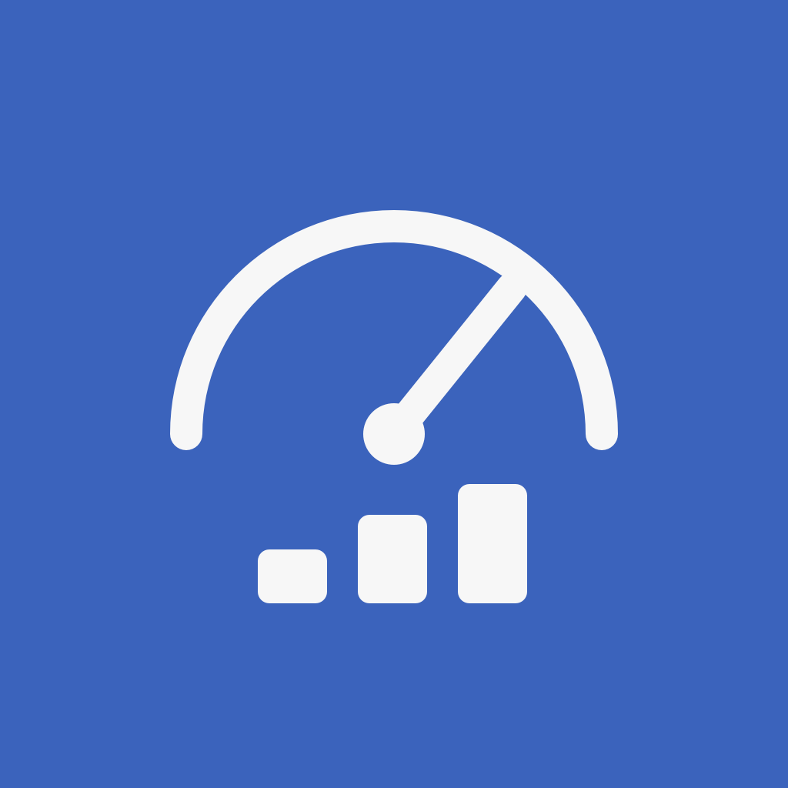
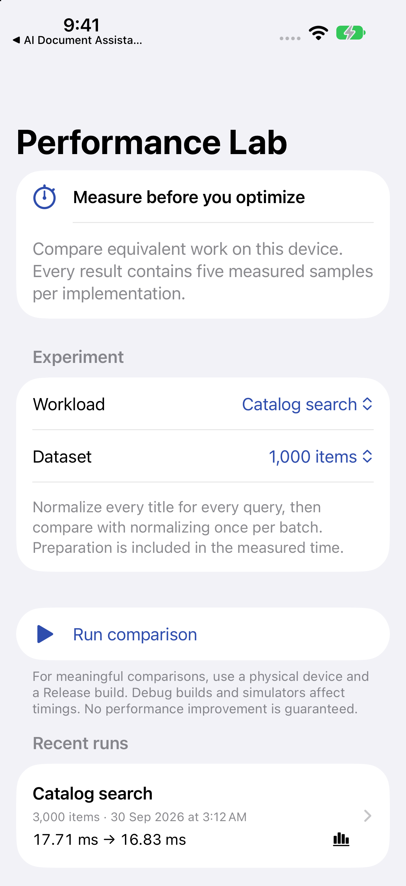

# App Performance Lab

Measure three concrete optimizations and inspect the work behind each result.

**iOS 15+ · iPhone and iPad · SwiftUI · MIT**



## What it does

- Compare repeated string normalization, DateFormatter allocation, and duplicate removal.
- Warm both implementations, alternate execution order, and collect five samples per path.
- Verify complete ordered output equality before accepting results.
- Inspect medians and raw samples, keep the latest 30 runs locally, and export CSV.
- Cancel long runs; unfinished runs are discarded when the app leaves the foreground.

## Run

Open `App Performance Lab.xcodeproj`, choose the shared **App Performance Lab** scheme, and run on an iPhone simulator or device. No third-party packages are required. Use your own signing team for a physical device; no developer-team identifier is committed.

Bundle ID: `com.dd.performancelab`. The deployment target is iOS 15. Initial builds were checked with Xcode 27; older OS runtime compatibility is not implied by a successful build. Xcode 16 or later is recommended for opening the project.

## Try it

Choose Catalog search and 3,000 items, run the comparison, then open the saved result. Compare individual samples, export the CSV, and repeat in a Release build on an iPhone. A slower optimized result is a valid observation, not an error.

For Instruments, follow [Profiling.md](Docs/Profiling.md).

## Structure

`Sources/Core/Benchmark.swift` contains deterministic workloads, statistics, and exported data. `BenchmarkStore` runs work in a cancellable task away from the main actor, records signpost intervals, verifies output equivalence outside the timed region, and persists completed runs atomically. The UI uses native lists and accessible timing bars.

## Verification

```sh
swift test
xcodebuild -project "App Performance Lab.xcodeproj" -scheme "App Performance Lab" \
  -destination 'generic/platform=iOS Simulator' CODE_SIGNING_ALLOWED=NO build
```

Core tests cover output equivalence for every workload across multiple dataset sizes, median calculation, invalid dataset bounds, and CSV sample retention. Timings are observations; no brittle speedup threshold is asserted.

The GitHub Actions workflow runs core tests and a simulator build. Review the actual workflow result in Actions rather than treating a badge or local build as proof of device behavior.

## Scope and limitations

This is a microbenchmark workbench, not a whole-app profiler. It does not claim to measure launch time, memory footprint, energy, scrolling hitches, or network performance. Simulator and Debug results are affected by their environments. Thermal state, background work, caches, and compiler optimization all affect results. Dataset preparation and allocation are included; result verification and disk writes are excluded. There are five measured samples, not a statistically powered study.

## Data and privacy

[PRIVACY.md](PRIVACY.md) describes storage, permissions, and sharing. Any sample clients and demo readings are fictional.

## License

[MIT](LICENSE), including original app artwork. See [Scripts](Scripts/README.md) to regenerate icons.
